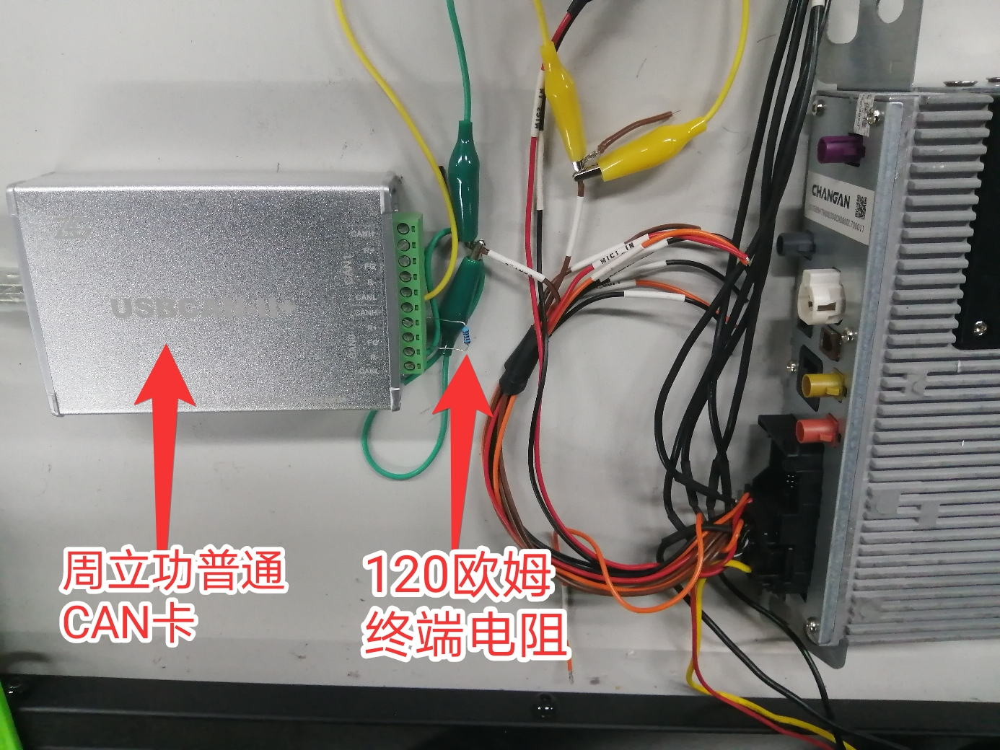
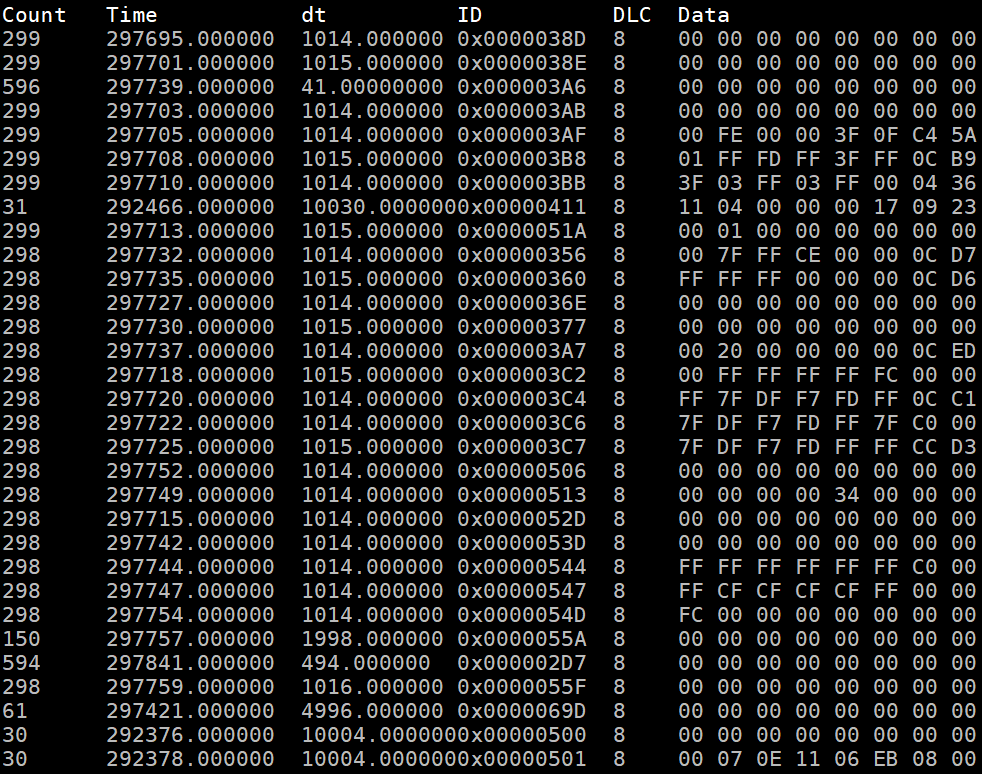

# ZLG CAN python


## Table of Contents

- [Background](#background)
- [Install](#install)
- [Usage](#usage)
	- [Generator](#generator)
- [Badge](#badge)
- [Example Readmes](#example-readmes)
- [Related Efforts](#related-efforts)
- [Maintainers](#maintainers)
- [Contributing](#contributing)
- [License](#license)

## Background


## Install

1. connect ZLG hardware


2. Clone code and change directories
```
git clone https://github.com/DC-Melo/ZLG_CAN_python.git
```

3. Install python3 packages
```
python3 -m pip install -r requirements.txt 
```
4. in the repository folder(ZLG_CAN_python),run command to check CAN message

```
python3 -m can.viewer --bitrate 500000 --channel 0 -i canalystii
```
then you will get CAN message like


5. after you can get CAN message from ZLG hardware. you can use script to send CAN message.
```
python3 send_one_message.py 
```
then you will get the CAN message send from ZLG


6. read the CAN dbc,and send CAN message.
```
python3 send_one_message_with_db.py 
```
then you will get the CAN message send from ZLG


## Usage


### Generator


## Badge

## Example Readmes


## Related Efforts


## Maintainers

[@DC-Melo](https://github.com/DC-Melo)

## Contributing


### Contributors


## License

[MIT](LICENSE) © DC-Melo王江

## Donation

如果你喜欢我的项目，请在对应的项目右上角 "Star" 一下。你的支持是我最大的鼓励！ ^^ 你也还可以扫描下面的二维码，对作者进行打赏。

If you like my project, "Star" in the corresponding project right corner, please. Your support is my biggest encouragement! ^^ You can also scan the qr code below or Donate to this project using Paypal, donation to Author.
---
<div align="center">


</div>

如果在捐赠留言中备注名称，将会被记录到列表中~ 如果你也是github开源作者，捐赠时可以留下github项目地址或者个人主页地址，链接将会被添加到列表中起到互相推广的作用

If you comment on the name in the donation message, it will be recorded in the list. ~If you are also an open source author of github, you can leave the GitHub project address or personal home page address when donating. Links will be added to the list to promote each other.
捐赠列表(Donation list)
